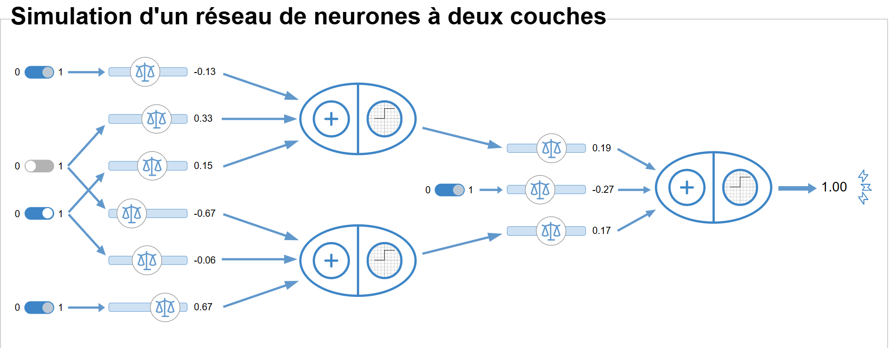

***A VISUAL GUIDE***  

Train your dragon : 
Automation : 
Two : 

**SIMULATEURS de NEURONES**  

NOT : 
ET  : 
OU  : 
XOR :  

**NUAGES de TENSOR FLOW**  
Nuage pour droite : 
Multi-zone : 
Contrentrique :   