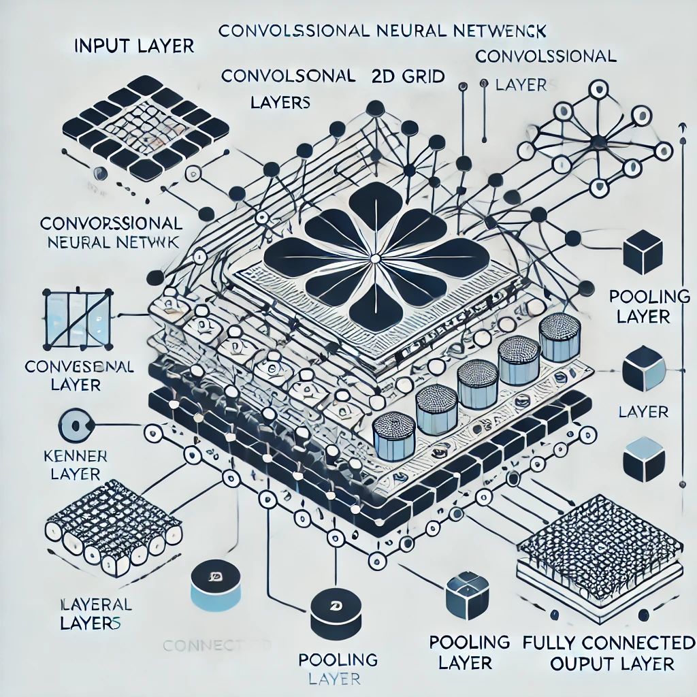

***LABO CONVOLUTIF***  

**Journal du labo convolutif**  

Classification de textes : https://colab.research.google.com/github/dipanjanS/nlp_workshop_odsc19/blob/master/Module05%20-%20NLP%20Applications/Project07B%20-%20Text%20Classification%20Deep%20Learning%20CNN%20Models.ipynb  

Votre colab public : https://drive.google.com/file/d/1Jf5AanMlkwdTJi_SSukMOIX4zkqaO3R4/view?usp=sharing

**Dessin de blocs**

